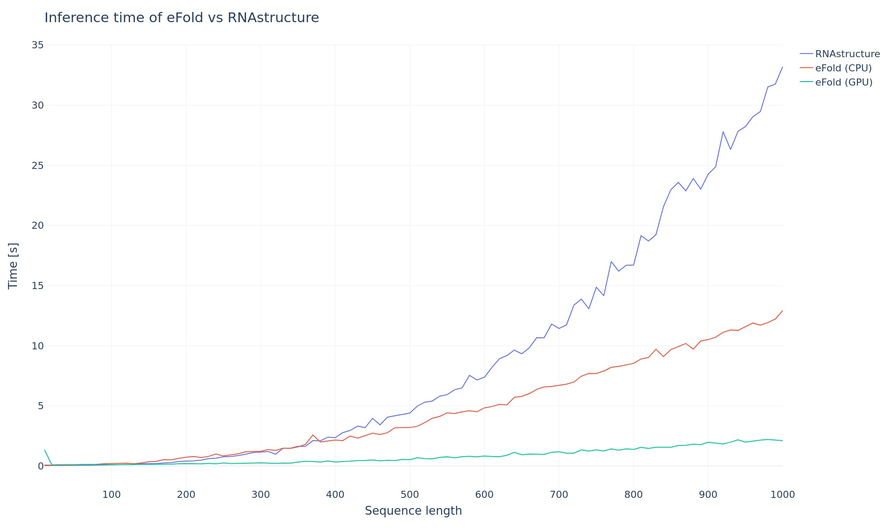

# eFold

This repo contains the pytorch code for our paper “*Diverse Database and Machine Learning Model to narrow the generalization gap in RNA structure prediction”* 

[[BioRXiv](https://www.biorxiv.org/content/10.1101/2024.01.24.577093v1.full)] [[Data](https://huggingface.co/rouskinlab)]

## Install

```bash
pip install efold
```


## Inference mode

### Using the command line

From a sequence:

```bash
efold AAACAUGAGGAUUACCCAUGU -o seq.txt
cat seq.txt

AAACAUGAGGAUUACCCAUGU
..(((((.((....)))))))
```

or a fasta file:

```bash
efold --fasta example.fasta
```

Using different formats:
```bash
efold AAACAUGAGGAUUACCCAUGU -bp # base pairs
efold AAACAUGAGGAUUACCCAUGU -db # dotbracket (default)
```

Output can be .json, .csv or .txt
```bash
efold AAACAUGAGGAUUACCCAUGU -o output.csv
```

Run help:
```bash
efold -h
```

### Using python

```python
>>> from efold import inference
>>> inference('AAACAUGAGGAUUACCCAUGU', fmt='dotbracket')
..(((((.((....)))))))
```

## Inference speed
Tested on a AMD EPYC 7272 12 core processor, with 32GB RAM and a RTX3090 GPU



## File structure

```bash
efold/
    api/    # for inference calls
    core/   # backend 
    models/ # where we define eFold and other models
    resources/
        efold_weights.py # our best model weights
scripts/
    efold_training.py # our training script
    [...]
LICENSE
requirements.txt
pyproject.toml
```

## Data

### List of the datasets we used

A breakdown of the data we used is summarized [here](https://github.com/rouskinlab/efold_data). All the data is stored on the [HuggingFace](https://huggingface.co/rouskinlab). 

### Get the data

You can download our datasets using [rouskinHF](https://github.com/rouskinlab/rouskinhf):

```bash
pip install rouskinhf
```

And in your code, write:

```python
>>> import rouskinhf
>>> data = rouskinhf.get_dataset('ribo500-blast') # look at the dataset names on huggingface
```


## Reproducing our results

### Training

A [training script](scripts/efold_training.py) is provided to train eFold from scratch.

### Testing

A [notebook](tests/test_eFold.ipynb) is provided to run eFold inference on the four test sets, compute the F1 score and check the validity of the structures.


## Citation

**Plain text:**

Albéric A. de Lajarte, Yves J. Martin des Taillades, Colin Kalicki, Federico Fuchs Wightman, Justin Aruda, Dragui Salazar, Matthew F. Allan, Casper L’Esperance-Kerckhoff, Alex Kashi, Fabrice Jossinet, Silvi Rouskin. “Diverse Database and Machine Learning Model to narrow the generalization gap in RNA structure prediction”. bioRxiv 2024.01.24.577093; doi: https://doi.org/10.1101/2024.01.24.577093. 2024

**BibTex:**

```
@article {Lajarte_Martin_2024,
	title = {Diverse Database and Machine Learning Model to narrow the generalization gap in RNA structure prediction},
	author = {Alb{\'e}ric A. de Lajarte and Yves J. Martin des Taillades and Colin Kalicki and Federico Fuchs Wightman and Justin Aruda and Dragui Salazar and Matthew F. Allan and Casper L{\textquoteright}Esperance-Kerckhoff and Alex Kashi and Fabrice Jossinet and Silvi Rouskin},
	year = {2024},
	doi = {10.1101/2024.01.24.577093},
	URL = {https://www.biorxiv.org/content/early/2024/01/25/2024.01.24.577093},
	journal = {bioRxiv}
}

```
